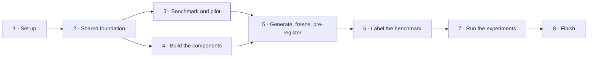

# FaithGuard: Phase-by-Phase Plan

This plan sets out every step needed to finish FaithGuard, from setup to the viva, in eight phases. It follows the revised research plan (`FaithGuard-Revised-Plan.md`), which holds the full method details. This plan says what to do, in what order, who does it, and how to tell when each phase is done. It has no dates.

## How the phases work

- **A phase ends at its gate.** Each phase has an exit checklist. When every item is ticked, that phase's outputs are frozen, and later phases can rely on them.
- **Phases 3 and 4 run side by side.** Every other phase starts only after the one before it passes its gate.
- **Nobody waits for a teammate.** If an input is late, use the fallback in the handover table (phase 4), record it in the decision log and carry on.
- **Stretch goals come last.** Start one only after the phase's exit checklist is complete.
- **If GPU or labelling hours run short,** apply the cut list from the top (end of this plan).

| Phase | Goal | Ends when |
| --- | --- | --- |
| 1. Set up | Prove the tools and free GPUs work | Repository and logs ready; GPU pilots timed |
| 2. Shared foundation | Build the common code, data and splits once | A rules-only slice runs end to end; splits frozen |
| 3. Benchmark and pilot | Write questions with gold answers; measure the real labelling rate | All question groups written and checked; annotation guide frozen |
| 4. Build the components | Detector, repairer and policy each work on development data | Each core model runs; every handover done or replaced by its fallback |
| 5. Generate, freeze, pre-register | Fix everything the results depend on | Answers stored; test set locked; models frozen; pre-registration filed |
| 6. Label the benchmark | Blinded, trustworthy human labels | All labels done; agreement measured; disagreements settled |
| 7. Run the experiments | A verdict for every pre-registered hypothesis | Every result traced to a command and a file |
| 8. Finish | Demo, data release, papers, report and viva | Four papers drafted; viva practised |

This replaces the five date-based phases described earlier. The old "build" phase is now phases 3–5, and "label and evaluate" is now phases 6 and 7, because each has its own gate.

## Rules for every phase

- **Weekly integration check:** the whole pipeline still runs end to end, with fallback inputs wherever a part is not ready.
- **Decision log and risk register:** every choice and every fallback used is written down with its reason.
- **GPU log:** every GPU run is logged with its hours. Compare the total against the budget at each gate.
- **Literature refresh at each gate:** if a new paper overlaps a claim, narrow the claim and cite the paper.
- **No number without its source:** every reported number comes from a command and a file in the repository.
- **Gold labels stay apart:** no component reads the gold store while making a decision.
- **AI-tool use** is disclosed as the university requires, and each member can explain their own code without help.

---

## Phase 1: Set up

**Goal:** prove that the tools and free GPUs work, before building anything. The supervisor has already approved the project, so no sign-off is needed.

| Task | Owner | Output |
| --- | --- | --- |
| Ask an accounting lecturer or senior student to act as adjudicator | All | A named adjudicator |
| Create the private code repository, folder layout, pinned requirements file and one setup cell for Kaggle and Colab | Sharaf | Installs identically on three laptops and on Kaggle |
| Set where outputs live (Kaggle Datasets or Google Drive) | Sharaf | Paths written in the repository README |
| Record each account's GPU quota; start the GPU-hour log | Each member | One row per account |
| Start the decision log and the risk register | Sharaf | Two shared documents |
| Repair GPU pilot: fp16 LoRA on Qwen3.5-2B on a T4 | M.S.A Ahamed | Loss curve, memory use and speed |
| Detector GPU pilot: LettuceDetect v1-large vs the v2 mmBERT encoder, fp16 with gradient checkpointing at 1–2K tokens | M.L Ahamed | Chosen checkpoint, memory use and speed |
| Generation pilot: Qwen3.5-9B and Gemma 4 12B-it at 4-bit with llama.cpp | Sharaf | Answers per GPU hour for each model |
| Closest prior work for each paper (only papers actually opened; preprints flagged) | Each member | A related-work table per paper |

**Exit checklist**

- [ ] Adjudicator asked
- [ ] Repository and environment install identically for all three members
- [ ] All three GPU pilots done; GPU-hour budget updated with measured timings
- [ ] Closest prior work listed for each paper

**If blocked**

- **fp16 LoRA fails:** try QLoRA (4-bit base model, fp32 LoRA maths), then Qwen3 1.7B, then 0.6B, then a prompt-only repairer.
- **No adjudicator found:** two members settle each disagreement together, and the papers report this as a limitation.
- **Generation is slower than budgeted:** shorten the maximum answer length, or spread runs across Sharaf's Kaggle and Colab accounts.

---

## Phase 2: Shared foundation

**Goal:** build the common code, data and splits once, so all three papers use the same inputs.

### Code

| Task | Owner | Output |
| --- | --- | --- |
| Record format v1 for questions, evidence cells, answers, detector output, decisions, repair programs and final outputs, with a version number | Sharaf | Schema, validator and examples |
| Gold store, kept apart from the record files | Sharaf | Gold answers and labels that only evaluation code reads |
| Calculation API: parse numbers (commas, brackets as negatives, currency, thousand / million / billion, Rs. '000, percent, basis points), normalise them, do Decimal arithmetic, apply rounding tolerance, and render results in the answer's style | M.S.A Ahamed | Tested library used by Channel B, repair and scoring |
| Deterministic executor for COPY and CALCULATE over cell references | M.S.A Ahamed | Tested executor that cannot run arbitrary code |
| Error injector for FinQA and TAT-QA: wrong cell, wrong period, scale off by 1,000, flipped sign, wrong base, missing operand | M.S.A Ahamed | Items with a known error type and an outcome the executor can score |
| Replay harness: runs keep, repair and abstain on every item and stores each outcome | Sharaf | Harness that reads and writes the record format |
| Statistics scripts: issuer-clustered bootstrap, Learn-then-Test helpers, Cohen's kappa | Sharaf | Tested scripts |

The calculation API is on the critical path: Channel B, the repairer and auto-scoring all need it, so build it first.

The revised plan gave no owner for two tasks, so this plan assigns them: the error injector (M.S.A Ahamed, because the executor scores its outputs) and the automatic-extraction run (Sharaf, phase 3).

### Data

| Task | Owner | Output |
| --- | --- | --- |
| Download FinQA and TAT-QA; note version and licence | M.S.A Ahamed | Data in the shared store with a licence note |
| Download RAGTruth; note version and licence | M.L Ahamed | Data in the shared store with a licence note |
| Download from EDGAR and parse XBRL with Arelle | M.L Ahamed | Facts table: concept, period, segment, entity, unit, scale |
| Collect Sri Lankan annual reports | All three, split by sector | Reports with source link and terms of use |
| Choose the benchmark issuers and assign every issuer to training, development, calibration or test; set aside a small future-period set | Sharaf | Split manifest, frozen with a hash |
| Self-host Label Studio Community 1.23.2 or later; write annotation guide v1 | M.L Ahamed | Working project with all label fields; guide v1 |

### Calibration data: option B (decision D-007)

The revised plan has 400 question groups from about 12 held-out issuers per country, but it does not say how they split between the calibration set and the test set. The two sets must come from different issuers. The policy's certificate and the detector's recalibration curve both need labelled calibration answers.

| Option | Calibration issuers | Test issuers | Cost |
| --- | --- | --- | --- |
| A. Split the same issuers | Half of them in each country | The other half (about 6 per country) | No extra work; wider test intervals |
| B. More issuers, same questions | About 12 new issuers per country | The original 12 per country | Same labelling hours; more reports to collect and tables to correct |
| C. Extra calibration questions | New issuers with new questions | The original 12, all 400 groups | More labelling hours |

**Chosen:** option B. It keeps 12 test issuers per country and leaves the labelling budget unchanged. The extra work is limited to correcting the tables the questions actually use. If that proves too slow, fall back to option A.

Under A or B, about 200 groups (400 answers) go to calibration and 200 to test. That gives about 250 Sri Lankan calibration answers, which is enough for the 200-label point on the recalibration curve.

### Thin end-to-end slice

This is a small rules-only run on 20–40 items: FinQA and TAT-QA items plus a few Sri Lankan tables, with injected or hand-made errors. A first version of Channel B (M.L Ahamed) checks the numbers, and a simple threshold policy (Sharaf) decides. The rule-only COPY/CALCULATE repairer with its gate (M.S.A Ahamed) makes the fixes. Sharaf joins the three parts together.

Its job is to prove that the record format and the connections between parts work before anyone trains a model. It is not the final demo.

**Exit checklist**

- [ ] Record format v1 and gold store frozen; all three members can read and write them
- [ ] Calculation API and executor pass their tests
- [ ] FinQA, TAT-QA, RAGTruth and XBRL facts loaded, with licences logged
- [ ] Split manifest frozen, with calibration and test issuers as in option B
- [ ] Label Studio running with guide v1
- [ ] The thin slice runs end to end on 20–40 items

---

## Phase 3: Benchmark and pilot (runs alongside phase 4)

**Goal:** write the questions with their gold answers, and measure the real labelling speed and error rate before full labelling starts.

| Task | Owner | Output |
| --- | --- | --- |
| Hand-correct the evidence tables the questions use | All three by sector (Sri Lanka); M.L Ahamed (US) | Corrected tables in the record format |
| Write 60 pilot questions (30 per country) from development issuers, with gold answers and gold cells | All three | Pilot questions |
| Generate 120 pilot answers (60 questions × 2 generators) | Sharaf | Stored pilot answers |
| Label every field of every pilot answer by hand; double-label a share | All three | Minutes per item, error rate, first agreement figures |
| Revise the annotation guide from the pilot's disagreements | M.L Ahamed | Guide v2, frozen |
| Write the question groups (150 US, 250 Sri Lanka; about 133 per member), each with gold answer, gold cells and question type | All three | Questions in the records; gold in the gold store |
| Cross-check every question: a second member recomputes its gold answer from the gold cells with the calculation API | All three | A checked flag on every question |
| Automatic-extraction run: three tools on 20 tables; keep the best | Sharaf | Evidence for the real-world condition |

### Decisions the pilot triggers (agreed in advance)

- **More than 6 minutes per item:** cut US groups to 120 first; keep all Sri Lankan groups.
- **Error rate below about 10%:** add harder question types, and report the low rate as a finding.
- **Labelling time to spare:** consider Granite 4.2 8B as a third generator.
- **In every case:** update the labelling-hours and GPU-hours budgets with the measured figures.

**Exit checklist**

- [ ] Pilot labelled; minutes per item and error rate recorded
- [ ] Annotation guide v2 frozen
- [ ] All question groups written, cross-checked and stored, with gold in the gold store
- [ ] Evidence tables hand-corrected; extraction run done on 20 tables
- [ ] Future-period set chosen and held back unopened

---

## Phase 4: Build the components (runs alongside phase 3)

**Goal:** each member builds their method, its ablations and its baselines on training and development data. No one runs anything on test data in this phase.

### Detection · M.L Ahamed

1. **Channel B, the rule checker.** Extract each numeric claim, normalise it, recompute it through the calculation API, look up XBRL facts for US filings, and link each claim to its table cell by value.
2. **Detector v0:** released LettuceDetect plus Channel B. Hand it to Sharaf.
3. **XBRL mining.** For each cited fact, find facts with the same value but a different period, segment, entity or concept. Each one becomes a wrong-context negative labelled with the slot that differs. Add scale and unit variants the same way.
4. **Training set:** RAGTruth spans, XBRL negatives and injected FinQA/TAT-QA errors. LLM silver labels may be used here, never for test labels; any LLM run counts against the GPU log.
5. **Channel A.** Warm-start from the checkpoint chosen in phase 1, then add the span head and the relation-slot head. Keep runs short and resumable, with a checkpoint at least every hour.
6. **Ablations on development data:** with vs without XBRL negatives (the main one), and with vs without the slot head.
7. **Fusion.** Fit the logistic regression over A and B. Prepare the calibration code (temperature or isotonic) and the Learn-then-Test threshold code. The real calibration uses the labelled calibration split in phase 7.
8. **Out-of-fold predictions** on the repairer's training items: train on some folds and predict the held-out fold. Hand them to M.S.A Ahamed for the KEEP targets.
9. **Baseline runners** for LettuceDetect v1-large, LettuceDetect v2, HHEM-2.1-Open and Granite Guardian 4.1-8B (at 4-bit), checked on development data.

- **GPU:** about 25–45 hours for training and ablations; 3–6 hours for baselines.
- **Stretch, only after the gate:** a consistency loss; the observer-probe signal (Channel C).

### Repair · M.S.A Ahamed

1. **Edit language.** A Pydantic schema for KEEP, COPY, CALCULATE and CANNOT_FIX with reason codes, and a grammar that allows only arithmetic over cell references.
2. **Dependency closure.** When a number changes, recompute or flag every growth rate, comparison and direction word built on it.
3. **Hard gate.** Check provenance (cell, period, unit, scope), closure, the edit envelope (nothing outside the flagged spans changed) and relevance. Allow one retry with the failure reason, then abstain.
4. **Repairer v0:** rule-only COPY and CALCULATE. Hand it to Sharaf.
5. **Training data:** FinQA and TAT-QA programs, XBRL substitutions, KEEP items from out-of-fold detector false positives, and CANNOT_FIX items with evidence deliberately removed. Keep some error types out of training, so RQ2 can test on unseen types.
6. **Stage A, supervised fine-tuning** of Qwen3.5-2B with LoRA in non-thinking mode, using the fallback chain from phase 1 if needed.
7. **Free-rewrite baseline:** same backbone, same data, free-text output (FRED-style).
8. **Zero-shot baselines:** programs from the untrained 2B model and from Qwen3.5-9B. The 9B runs on Sharaf's quota.
9. **Stage B, executor-verified self-training.** Sample several programs per item, keep only those the executor and gate accept, and fine-tune on them. Repeat for 2–3 rounds, saving after each round.
10. **Deployed-runtime check** on a laptop: valid-program rate and latency of the 4-bit model.
11. **Time the test runs.** Every repair variant must later run on all calibration and test items, with gold and with predicted spans. That GPU work is not itemised in the budget, so time it on development data now and add it.

- **GPU:** about 10–20 hours for fine-tuning; 12–20 hours for self-training.
- **If no fine-tuning works on a T4:** compare prompted edit programs with prompted free rewriting, using the same model and the same examples. RQ1 still stands; RQ2 is reported as not tested, with the reason.
- **Stretch, only after the gate:** Qwen3.5-4B with QLoRA; a Granite 4.2 3B replication; REPLACE with a neural checker.

### Decision policy · Sharaf

1. **Controlled track:** FinQA and TAT-QA items with injected errors, where the executor scores every outcome automatically.
2. **Features, taken before any action:** fused detector score, Channel B verdict, failing-slot counts, link count, missing operands, an evidence-sufficiency check, claim counts and question type.
3. **Replay** with detector v0 and repairer v0: run every action on every item and build the 3 × 3 flip matrix.
4. **Outcome models:** LightGBM for P(unsafe) and P(fix), with TabICLv2 as the challenger.
5. **Decision rule** and the (τ1, τ2) grid, ready to pre-register in phase 5.
6. **Certification code:** Learn-then-Test with fixed-sequence testing and Hoeffding–Bentkus p-values on the linearised loss, plus SCoRE as the comparator and the certification-budget curve. Test the code on simulated data where the true risk is known.
7. **Independence check.** The certificate assumes the items are independent, but answers from the same issuer are related. Design an issuer-level sensitivity check, ready to pre-register.
8. **Baselines:** calibrated detector threshold, always keep, always repair, a static four-state classifier and the stored-outcome oracle.
9. **Transfer rehearsal.** When repairer v1 arrives, run the v0 policy on v1's outputs three ways on the controlled track: as-is, recalibrated and refitted.

- **Compute:** CPU only. Sharaf's GPU quota covers answer generation and backs up the other two members.
- **Stretch, only after the gate:** Conformal Policy Control as a fourth transfer arm; a separate harm head; a compute-aware decision rule.

### Handovers

| What | From | To | If late, use |
| --- | --- | --- | --- |
| Calculation API and executor | M.S.A Ahamed | M.L Ahamed, Sharaf | No fallback; it is built first, in phase 2 |
| Detector v0 | M.L Ahamed | Sharaf | Released LettuceDetect alone |
| Repairer v0 | M.S.A Ahamed | Sharaf | COPY and CALCULATE rules run directly through the executor |
| Out-of-fold detector predictions | M.L Ahamed | M.S.A Ahamed | False positives from released LettuceDetect |
| Pilot and full answers | Sharaf | All | Another member runs the same pinned script on their own quota |
| Final detector | M.L Ahamed | M.S.A Ahamed, Sharaf | Released LettuceDetect plus Channel B |
| Repairer v1 | M.S.A Ahamed | Sharaf | Prompt-only program repairer |

**Exit checklist**

- [ ] Each member's core model runs end to end on development data (the policy on the controlled track)
- [ ] Each main ablation and every baseline has run on development data
- [ ] Every handover done, or its fallback recorded
- [ ] GPU hours within budget, or the cut list applied

---

## Phase 5: Generate, freeze and pre-register

**Goal:** fix everything the results depend on before anyone sees a test result.

| Task | Owner | Output |
| --- | --- | --- |
| Generate answers for every question group with both generators (4-bit, llama.cpp, fixed prompt, seed, temperature and length) | Sharaf | About 800 answers, stored with hashes |
| Freeze evidence and retrieval, so every method sees the same evidence for each question | Sharaf | Evidence manifest with a hash |
| Lock the test set: questions, evidence and answers | Sharaf, checked by all | Locked manifest with a hash |
| Freeze the detector, its fusion and its ablation variants | M.L Ahamed | Hashes in the repository |
| Freeze repairer v1 and every repair variant used in an experiment | M.S.A Ahamed | Hashes in the repository |
| Write and file the pre-registration | All; filed by Sharaf | A registration link (OSF Registries is free) or a tagged commit pushed to GitHub |

**The pre-registration states:**

- all nine hypotheses, with their confirm and reject conditions;
- each paper's primary comparison: XBRL negatives vs none; edit programs vs free rewriting at a matched correction rate; the outcome-aware policy vs the threshold policy;
- the risk target α = 0.10 and the (τ1, τ2) grid;
- the split manifest's hash, including the calibration-versus-test choice;
- metric definitions, the issuer-clustered bootstrap and the issuer-level sensitivity check;
- the recalibration label sizes (25, 50, 100 and 200);
- the rule for expanding repair labelling (code and humans disagree on more than about 10% of sampled repairs);
- the code version (commit hash) used for the analysis.

**Exit checklist**

- [ ] All answers generated and stored
- [ ] Evidence frozen and test set locked
- [ ] Detector, repairer v1 and all variants frozen
- [ ] Pre-registration filed

---

## Phase 6: Label the benchmark

**Goal:** blinded, trustworthy labels for every natural answer and a sample of repairs, in both the calibration and test splits.

1. **Run every frozen system** on the calibration and test items. That means the detector, its ablation variants and the four baselines, plus every repair variant with gold spans and with predicted spans, and the replay of every action. Store all outputs.
2. **Run the code checks.** Compare every number in every original answer and every repair with the gold answers, and auto-score every repair.
3. **Blind and shuffle.** Remove system and generator names and mix the items. Where possible, no member labels their own component's outputs.
4. **Label the original answers** (800 answers, about 53 hours): spans, slot types, usefulness and ambiguous cases. "Ambiguous" is a valid label.
5. **Check 400 sampled repairs** (about 27 hours): confirm the auto-scores, and score usefulness and information preserved. Include every repair variant in the sample, especially free rewriting, whose changes code can check least well. If code and humans disagree on more than about 10%, expand human checking of repairs.
6. **Double-label 240 items** (about 16 hours) and compute Cohen's kappa for each field.
7. **Adjudicate.** The adjudicator settles disagreements and ambiguous accounting cases.
8. **Freeze the labels** in the gold store with a version number.

With the pilot, labelling comes to about 105 hours, or about 35 per member.

**Exit checklist**

- [ ] All 800 original answers labelled
- [ ] 400 sampled repairs checked, and more if the 10% rule triggered
- [ ] Kappa computed for each field
- [ ] Disagreements adjudicated; gold store frozen

---

## Phase 7: Run the experiments

**Goal:** answer every research question on the labelled data, exactly as pre-registered, and report every outcome, including negative ones.

Report counts of issuers, questions and answers separately, and use the issuer-clustered bootstrap for every interval.

### Detection · M.L Ahamed

| Experiment | Question it answers |
| --- | --- |
| Channel A with vs without XBRL negatives, at an equal clean false-alarm rate | RQ1, the main ablation |
| A alone, B alone, and A + B, by country | RQ2 |
| With vs without the slot head | Does naming the error help find it? |
| US-calibrated threshold on Sri Lankan test data as-is, then recalibrated with 25, 50, 100 and 200 Sri Lankan calibration labels | RQ3 |
| The four released detectors | Is the new detector better than existing tools? |

**Metrics:** span F1 by slot type, wrong-context recall, false-alarm rate on clean answers, AUROC, Brier score, ECE, and coverage at certified selective risk (α = 0.10).

### Repair · M.S.A Ahamed

| Experiment | Question it answers |
| --- | --- |
| Edit programs vs free rewriting, same backbone and data | RQ1, the main comparison: the correction-vs-harm frontier |
| Rule-only repair; zero-shot programs from 2B and 9B | Is training needed at all? |
| Supervised only vs supervised plus self-training, on unseen error types and on each generator | RQ2 |
| Gold vs predicted spans; with vs without KEEP training | RQ3 |
| Dependency closure on vs off | Does closure prevent half-fixed answers? |

**Metrics:** correction rate, new-error rate, damage rate, information preserved, abstention calibration, valid-program rate in the 4-bit runtime, and latency.

### Decision policy · Sharaf

| Experiment | Question it answers |
| --- | --- |
| Fit the outcome models on controlled-track and development items, certify on calibration, evaluate on test; compare with the threshold policy, always keep, always repair, the static classifier and the oracle | RQ1 |
| The certificate at α = 0.10, the certification-budget curve and the issuer-level sensitivity check | RQ2 |
| The v0 policy on v1 outputs: as-is, recalibrated and refitted | RQ3 |
| Train on Qwen answers, test on Gemma answers | Generator shift |
| LightGBM vs TabICLv2 | Does a foundation model help on a few hundred items? |

**Metrics:** emission coverage, residual risk, useful coverage, the flip matrix, regret against the oracle, Brier score and ECE, and residual risk by group (numeric vs narrative, US vs Sri Lanka).

### Whole system · all three

Run the full pipeline on the test set: frozen detector, certified policy, repairer v1, then the gate. Run it once with hand-corrected evidence and once with automatic extraction, and report emission coverage, residual risk and useful coverage. The FinRank external test is optional.

### Results check

- Fill in the hypothesis table: confirmed, rejected, or not tested (with the reason).
- List every deviation from the pre-registration, with its reason.
- Re-run every table and figure from a clean copy of the repository with one command each.

**Exit checklist**

- [ ] Every pre-registered comparison has run
- [ ] Every hypothesis has a verdict
- [ ] Every number traces to a command and a file
- [ ] Deviations from the pre-registration listed

---

## Phase 8: Finish

### Demo

- Runs on a laptop with precomputed outputs and live rule checks, so it never needs a GPU.
- Walks through the worked example (detection, policy, repair program, gate, fixed answer) and one abstention.
- Each member can run and explain their own part on request.

### Release

- **Benchmark:** questions, gold answers, labels and page pointers, plus Sri Lankan PDFs only if their terms allow. A data card covers sources, splits, labelling, agreement and known limits. The licence is chosen and recorded.
- **Code:** a pinned environment and one command per table and figure.
- **Models:** detector weights and LoRA adapters only where the base models' licences allow, each with a model card.

### Papers

| Paper | Lead | Core result |
| --- | --- | --- |
| Right Number, Wrong Context | M.L Ahamed | XBRL supervision and US-to-Sri-Lanka recalibration |
| Edit Programs, Not Rewrites | M.S.A Ahamed | Correction vs harm of program repair |
| Should We Fix It? | Sharaf | Certified outcome-aware policy and repairer-change transfer |
| Sri Lankan and US benchmark | All three | First public Sri Lankan resource of its kind found |

Each paper covers:

- the problem;
- the closest prior work and the claims it avoids;
- the method and the pre-registered setup;
- results, including negative ones;
- limitations (free GPUs, few issuers, two generators, synthetic training errors);
- how to reproduce it.

Before submitting each paper:

- read the venue's call (FinNLP, SLIIT ICAC or ACM ICAIF) for scope, page limit, anonymity and preprint rules;
- add the AI-use disclosure;
- use the authorship order in `docs/authorship.md`.

### Final report and viva

- A final report, mapped to the module's mark sheet.
- A one-page plain summary per member.
- A tough-questions bank, practised aloud. Some to start with:

| Member | Be ready for |
| --- | --- |
| M.L Ahamed | Why train on XBRL when VeriFin uses it only at inference? If rules catch most number errors, what does the learned detector add? How sure are you of the shift result with so few Sri Lankan issuers? |
| M.S.A Ahamed | How is this different from FRED? Isn't executor-verified self-training just RL by another name? What happens when the detector flags a correct number? |
| Sharaf | CORA and Release Control already choose between accepting, repairing and abstaining, so what is new? Does the certificate hold when answers from one issuer are related? Why α = 0.10 and not 0.05? |

**Exit checklist**

- [ ] Demo runs on a laptop without a GPU
- [ ] Release package complete
- [ ] Four paper drafts complete
- [ ] Final report complete
- [ ] Each member has done a practice viva

---

## Each member's path

| Phase | M.L Ahamed · detection | M.S.A Ahamed · repair | Sharaf · policy |
| --- | --- | --- | --- |
| 1 | Detector GPU pilot; prior work | Repair GPU pilot; prior work | Repository and logs; generation pilot; prior work |
| 2 | EDGAR and XBRL; RAGTruth; Label Studio and guide v1; first Channel B for the slice | Calculation API; executor; error injector; FinQA and TAT-QA; rule-only repair for the slice | Record format; gold store; replay harness; splits; statistics; joins the slice together |
| 3 | US and Sri Lankan tables; guide v2; questions; pilot labels | Sri Lankan tables; questions; pilot labels | Pilot answers; extraction run; Sri Lankan tables; questions; pilot labels |
| 4 | Channel B, v0, XBRL mining, Channel A, ablations, fusion, out-of-fold predictions, baseline runners | Edit language, closure, gate, v0, training data, fine-tuning, free-rewrite baseline, self-training | Controlled track, features, replay, outcome models, certification, baselines, transfer rehearsal |
| 5 | Freeze detector and variants | Freeze repairer v1 and variants | Generate answers; lock test set; file pre-registration |
| 6 | Run detectors; about 32 hours of labelling | Run repairers; about 32 hours of labelling | Run the replay; about 32 hours of labelling; kappa |
| 7 | Detection experiments | Repair experiments | Policy experiments; whole-system run |
| 8 | Paper 1; demo part; viva | Paper 2; demo part; viva | Paper 3; joins the demo together; viva |

All three share the benchmark paper and the release.

## Cut list

If GPU or labelling hours run short, cut from the top. Each cut keeps every paper's minimum publishable result intact.

| Order | Cut | Saves work in phases |
| --- | --- | --- |
| 1 | TabICLv2 challenger (policy) | 4, 7 |
| 2 | Granite Guardian baseline (detection) | 4, 6, 7 |
| 3 | Second and third self-training rounds (repair) | 4 |
| 4 | FinRank external test (shared) | 7 |
| 5 | Automatic-extraction run; keep only corrected evidence (shared) | 3, 7 |
| 6 | Generator-shift test (policy and detection) | 7 |
| 7 | Slot-head ablation (detection) | 4, 7 |

**Never cut:** the human-labelled natural test set, the clean false-alarm rate, the certified risk study, each paper's main ablation, and the end-to-end demo.
