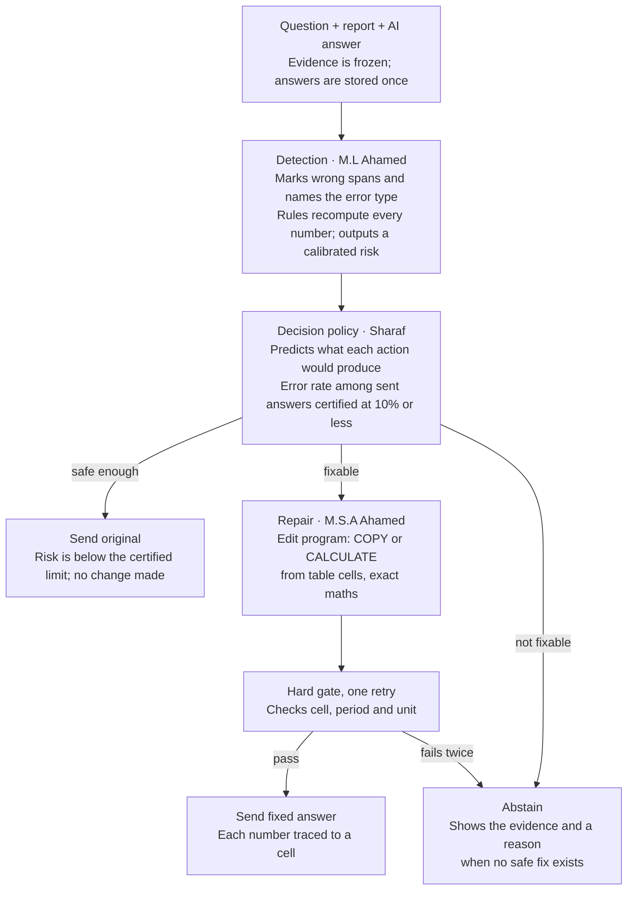
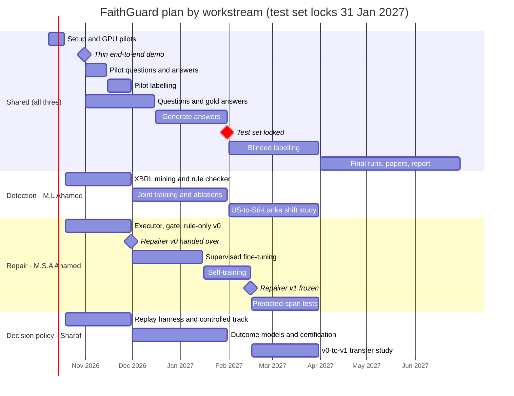

# FaithGuard: Revised Research Plan

8 October 2026 (updated the same day: no university GPU)

## Update: no university GPU

The team cannot get a university GPU, so this version runs entirely on free Colab and Kaggle GPUs and laptop CPUs. No paid compute is assumed either.

- **No core result changes.** Every core task already fit a free T4 or a laptop CPU.
- **Two stretch goals move to future work:** GRPO training for repair and a 27B answer generator. Both might just fit free GPUs (GRPO with QLoRA on a 2B model; a 4-bit 27B model split across Kaggle's two T4s), but they would be slow and fragile there, and no paper's minimum result needs them.
- **Fallbacks no longer mention a university GPU.** If fp16 training fails on a T4, the order is now QLoRA, then a smaller model, then a prompt-only repairer.
- **A GPU-hour budget is added.** Rough estimates suggest the whole project needs about 75–130 free GPU hours, spread over five months and three accounts.
- **Answer generation runs on Sharaf's quota,** because the policy paper needs no GPU. This frees the other two accounts for training.

## Summary

The revised plan keeps FaithGuard's idea but cuts its breadth, so each member delivers one deep, publishable contribution instead of many shallow ones.

- **What stays:** the three components (detection, decision policy, repair), the US and Sri Lanka benchmark, certified risk control and pre-registered, honest evaluation.
- **What shrinks:** 13 datasets become 4 plus XBRL facts, 3 answer generators become 2, and the main test uses hand-corrected tables. Code checks the numbers, so human labelling drops from about 240 to about 105 hours, including the pilot and double review.
- **What is simplified:** repair handles numeric errors only and uses no reinforcement learning (RL). The policy uses two outcome models instead of five heads.
- **Compute:** free Colab and Kaggle GPUs and laptop CPUs only. Anything that would be slow or fragile on them is future work.
- **New rule:** every member's paper must stand on its own. If a teammate's part is late, that paper switches to a ready-made fallback (a released detector, a rule-only repairer), so no paper waits for another.
- **Target:** a thin end-to-end demo by 31 October 2026, then three individual papers and one joint benchmark paper, drafted by 31 May 2027.

Nothing in this plan has been built or measured yet. Every result below is a hypothesis with a stated way to reject it.

## Concerns and how this plan answers them

Ten concerns came out of the review of the four design documents. Each one now has a specific change.

| # | Concern | What could go wrong | What this plan does |
| --- | --- | --- | --- |
| 1 | Scope is too large for 3 people in about 8 months | Parts stay unfinished and never connect | One core contribution per member; stretch goals labelled; a written cut list |
| 2 | About 240 hours of human labelling | Labelling blocks everyone in Feb–Mar 2027 | Gold answers written with each question; code checks numbers; 2 generators; sampled repair checks |
| 3 | The policy depends on every other part | Policy work cannot start until March | A controlled track with auto-scored outcomes from November; fallback detector and repairer |
| 4 | Small sample (about 12 test issuers per country) | Wide intervals; α = 0.05 not certifiable | α = 0.10 pre-registered as primary; certification-budget curve reported as a finding |
| 5 | Nothing is built yet | A weak first progress review | Thin end-to-end slice (20–40 items, rules only) by 31 October 2026 |
| 6 | The documents are hard for non-specialists | The panel gets lost | A plain one-page summary per member and one worked example traced end to end |
| 7 | Finance focus vs the approved title | A scope dispute late in the year | Resolved: the supervisor has approved the project as planned |
| 8 | Only free GPUs (T4, P100), no university GPU; they lack bf16 and end sessions | Training fails, keeps restarting or runs out of quota | No RL; fp16 pilot in week 1 with a QLoRA fallback; short resumable runs; generate answers once; a GPU-hour budget per account |
| 9 | Papers depend on each other | One delay sinks two papers | Each paper has its own fallback inputs |
| 10 | Many cited works are very recent preprints | A key claim rests on unreviewed work | Main claims rest on peer-reviewed work or own results; preprints flagged; literature refreshed monthly |

## Project at a glance

FaithGuard checks each AI answer about a financial report before it reaches the user. It then sends the answer, fixes it, or refuses with a reason.

**Shared foundation (all three members):** US and Sri Lankan benchmark · gold answers · issuer-disjoint splits · one record format.

Detection feeds the policy, and the policy decides whether repair runs. Repair can still end in abstention if its fix fails the gate twice.

### Worked example

The question is "What was the Group's profit after tax in FY2025?" The AI answers: "Group profit after tax rose 7.0% to Rs. 12,450 million."

1. **Detection** flags "Rs. 12,450 million" with two slots. *Entity or scope*: it is the Bank's figure, not the Group's. *Scale*: the column is in Rs. '000. It also flags "7.0%" as depending on that number.
2. **The policy** sees that the correct Group figure is in the table, so P(fix) is high. It chooses repair.
3. **Repair** writes a program: COPY the Group 2025 cell, then CALCULATE growth from the Group 2025 and 2024 cells. The executor runs it, and the gate confirms the cell, period and unit, and that nothing else changed.
4. **The fixed answer is sent.** Had the Group figure been missing, repair would return CANNOT_FIX, and the user would get the evidence and a reason instead.

The numbers in this example are illustrative, not results.

## Shared foundation

All three papers use one benchmark, built once and frozen, so their results can be compared and combined.

### Data

| Source | Role | Labels | Licence |
| --- | --- | --- | --- |
| RAGTruth | General span training for detection | Human spans | MIT |
| FinQA | Gold programs for repair targets; injected errors | Gold answers and programs | MIT |
| TAT-QA | Table-and-text arithmetic targets | Gold answers | CC BY 4.0 |
| US XBRL facts (SEC EDGAR) | Automatic wrong-context negatives; operand checks | Automatic | Public filings |
| Team benchmark, US and Sri Lanka | Main natural-error test, calibration set, policy outcomes | Human, blinded | Team release terms |

FinRank (fresh 2024–25 US questions, CC BY-NC 4.0) is the one optional external test. All other datasets from the previous plan move to future work.

### Answers and evidence

- **Two generators:** Qwen3.5-9B and Gemma 4 12B-it, both Apache-2.0, run once at 4-bit with llama.cpp on a free T4 and stored. Two vendors are enough for a leave-one-generator-out test. Granite 4.2 8B is added only if the pilot shows labelling time allows.
- **Questions:** 150 US and 250 Sri Lankan question groups from about 12 held-out issuers per country. Each question is written with its gold answer, gold table cells and question type. This step is what lets code check numbers later.
- **Evidence:** the main test uses hand-corrected tables, so table-reading errors cannot be mistaken for model errors. One automatic-extraction run, using the best of three tools on 20 tables, is reported as the real-world condition.
- **Retrieval is frozen.** Every method sees the same evidence for the same question.

### Rules that keep results honest

- Training, development, calibration and test splits are issuer-disjoint: one company never appears in two splits.
- The test set is locked before any tuning. A small future-period set is held back for a 2027 refresh.
- One versioned record format is shared by all components. Gold labels live in a separate store that no component reads at decision time.
- Hypotheses, risk target (α = 0.10), splits and primary comparisons are pre-registered before the test set is opened.
- Intervals use a bootstrap clustered by issuer. Counts of issuers, questions and answers are always reported separately.

### Who owns each shared task

| Shared task | Owner |
| --- | --- |
| Record format, replay harness, split manifest, statistics scripts | Sharaf |
| Answer generation runs, on Sharaf's GPU quota (the policy needs no GPU) | Sharaf |
| Calculation API and deterministic executor | M.S.A Ahamed |
| US data: EDGAR download, XBRL parsing with Arelle | M.L Ahamed |
| Label Studio setup and annotation guide | M.L Ahamed |
| Sri Lankan reports: collection and table correction | All three, split by sector |
| Question writing with gold answers (about 133 groups each) | All three |

## Member 1: Detection (M.L Ahamed)

This paper tests whether free, automatically mined XBRL errors teach a detector to catch "right number, wrong context" mistakes, and whether it still works when moved from US to Sri Lankan reports.

**Working title:** Right Number, Wrong Context: Relation-Aware Hallucination Detection for Financial Report QA with XBRL-Mined Supervision

**Defensible claim:** XBRL facts are used as a *training* signal for a span detector. VeriFin uses XBRL only at inference time. The detector also names the failing financial relation, and it is tested across a real US-to-Sri-Lanka shift with a measured recalibration cost.

**Claims to avoid:** the first financial hallucination detector; the first typed or span-plus-evidence detector.

### Research questions

1. Do XBRL-mined wrong-context negatives raise detection of wrong-context errors in natural answers, at an equal false-alarm rate on clean answers?
2. Where does a learned detector add value over exact rules: Sri Lankan reports without XBRL, claims with no printed number, or correct claims that rules reject?
3. Does a threshold calibrated on US filings hold on Sri Lankan reports, and how many Sri Lankan labels does recalibration need?

### Method (core)

- **Channel A, the learned detector.** One encoder, warm-started from a released LettuceDetect checkpoint (v1-large or the v2 mmBERT encoder, chosen in the week-1 pilot). It has two heads:
  - a span head that tags unsupported answer tokens;
  - a relation-slot head that names the failing part: entity or scope, metric, period, unit, scale or currency, sign, basis, or missing operand.
- **Channel B, the rule checker.** It extracts each numeric claim, normalises it and recomputes it with Decimal arithmetic through the shared calculation API. For US filings it looks up XBRL facts. Channel B also links each claim to its table cell by value matching, which replaces the learned evidence pointer.
- **Fusion and calibration.** A logistic regression combines A and B. Temperature scaling or isotonic regression calibrates the result, and Learn-then-Test picks the threshold.
- **XBRL mining recipe.** For each cited fact, find facts with the same value but a different period, segment, entity or concept. Each one becomes a wrong-context negative labelled with the slot that differs. Scale and unit variants (thousands vs millions, percent vs basis points) are added the same way.

### Experiments

| Comparison | Question it answers |
| --- | --- |
| Channel A with vs without XBRL negatives | RQ1, the main ablation |
| A alone, B alone, A + B | RQ2: what rules already solve |
| With vs without the slot head | Does naming the error improve finding it? |
| US threshold on Sri Lankan data as-is, then recalibrated with 25, 50, 100 and 200 local labels | RQ3: a label-efficiency curve |
| LettuceDetect v1-large, LettuceDetect v2 encoder, HHEM-2.1-Open, Granite Guardian 4.1-8B | Is the new detector better than released ones? |

**Metrics:** span F1 by slot type, wrong-context recall, false-alarm rate on clean answers (a headline metric), AUROC, Brier score and ECE, and coverage at certified selective risk (α = 0.10).

### Hypotheses

| Hypothesis | Confirmed if | Rejected if |
| --- | --- | --- |
| H1. XBRL negatives raise wrong-context recall | Higher recall at an equal clean false-alarm rate | False alarms rise or recall does not move |
| H2. A + B beats B alone on Sri Lankan reports | Higher span F1, intervals not overlapping | No gain; rules suffice, reported as such |
| H3. The US threshold fails on Sri Lanka; about 100 local labels restore it | Risk above α before, within α after | Holds without recalibration; also reported |

### Scope

- **Minimum publishable result:** the trained detector, the XBRL ablation, the clean false-alarm rate and the recalibration curve, all on human-labelled natural errors. This counts even if no baseline is beaten.
- **Stretch:** a consistency loss against simple augmentation; the observer-probe signal (Channel C).
- **Stands alone:** it needs only the shared benchmark, not repair or the policy.
- **Compute:** a 0.3–0.4B encoder at 1–2K tokens in fp16 with gradient checkpointing fits a free T4. No university GPU is needed.

## Member 2: Repair (M.S.A Ahamed)

This paper tests whether a small local model that writes checkable edit programs fixes wrong financial numbers while creating fewer new errors than free rewriting.

**Working title:** Edit Programs, Not Rewrites: Verifiable Repair of Numeric Errors in Financial Answers with Small Local Models

**Defensible claim:** a model of at most 4B parameters writes typed, evidence-bound edit programs with bounded dependency closure. It is trained with supervised fine-tuning, then with executor-verified self-training. It is judged on correction against introduced harm, on natural errors, with both gold and predicted spans.

**Claims to avoid:** that executable edits, deterministic copying or a verify-repair-abstain loop are new in themselves. FRED, VeriFin and FinGround already cover parts of this.

### Research questions

1. At the same correction rate, do edit programs introduce fewer new numeric errors than free-text editing with the same model and data?
2. Does executor-verified self-training improve on supervised fine-tuning alone, especially on held-out error types and the held-out generator?
3. How much does repair degrade when spans come from a real detector, and does training on detector false positives (KEEP targets) close that gap?

### Method (core)

- **Edit language, four operations:**
  - KEEP leaves a span unchanged;
  - COPY copies a value from a table cell;
  - CALCULATE computes a value from cells, with arithmetic only;
  - CANNOT_FIX gives up with a reason code.

  Non-numeric errors lead to abstention. Free-text REPLACE moves to future work.
- **Executor:** a Pydantic schema, Decimal arithmetic and a grammar that allows only arithmetic over cell references. Arbitrary code cannot be expressed.
- **Dependency closure:** when a number changes, every claim derived from it (growth rates, comparisons, direction words) is recomputed or flagged.
- **Hard gate:** checks provenance (right cell, period, unit, scope), closure, the edit envelope (nothing outside the flagged spans changed) and relevance (the answer still answers the question). One retry with the failure reason, then abstain.
- **Model:** Qwen3.5-2B with LoRA in non-thinking mode; 4B as a stretch. An fp16 pilot on a free T4 runs in week 1. If it fails, try these in order, all on a free T4:
  1. QLoRA: the base model loaded in 4-bit, with the LoRA weights and maths in fp32 (slower, but avoids fp16 overflow);
  2. a smaller Qwen3 model (1.7B, then 0.6B), as the original plan allows;
  3. a prompt-only repairer, as described under Scope.
- **Stage A, supervised fine-tuning:** targets from FinQA and TAT-QA programs, XBRL substitutions, KEEP items from out-of-fold detector false positives, and CANNOT_FIX items with evidence deliberately removed.
- **Stage B, executor-verified self-training:** sample several programs per item, keep only those the executor and gate accept, fine-tune on them, and repeat 2–3 rounds. It runs on a free T4. It is reported as rejection-sampling fine-tuning, not as RL. GRPO moves to future work: it might fit a free T4 with QLoRA, but it is slower and less stable, and no research question needs it.

### Experiments

| Comparison | Question it answers |
| --- | --- |
| Free-text rewrite, same backbone and data (FRED-style) | RQ1, the main baseline |
| Rule-only COPY and CALCULATE | What rules alone can fix |
| Zero-shot programs from the untrained 2B model and from Qwen3.5-9B | Is training needed at all? |
| Supervised only vs supervised plus self-training | RQ2 |
| Gold spans vs predicted spans; with vs without KEEP training | RQ3 |
| Dependency closure on vs off | Does closure prevent half-fixed answers? |

**Metrics:** correction rate, new-error rate, damage rate (correct claims made wrong), information preserved (human-scored sample), abstention calibration, valid-program rate in the deployed 4-bit runtime, and latency.

### Hypotheses

| Hypothesis | Confirmed if | Rejected if |
| --- | --- | --- |
| H1. Programs create fewer new errors than free rewriting | Lower new-error rate at a matched correction rate | No difference; reported as a negative result |
| H2. Self-training improves out-of-distribution repair | Gains on held-out error types and generator | Gains only on seen error types |
| H3. KEEP training cuts harm from detector false positives | Lower damage rate with predicted spans | No change |

### Scope

- **Minimum publishable result:** the executor, the supervised model, the free-rewrite baseline and the correction-vs-harm frontier on natural errors with gold spans.
- **If no fine-tuning works on a free T4:** the paper compares prompted edit programs with prompted free rewriting, using the same model and the same few examples. RQ1, the main question, still stands; RQ2 is reported as not tested, with the reason.
- **Stretch (all fit a free T4):** a Qwen3.5-4B backbone with QLoRA; Granite 4.2 3B replication; REPLACE with a neural checker.
- **Future work:** GRPO. It might fit a free T4 with QLoRA, but it needs more time and tuning than the schedule allows.
- **Stands alone:** it works with gold spans. Predicted spans come from Channel A, or from released LettuceDetect if Channel A is late.
- **Hands over:** repairer v0 (rule-only) by 30 November 2026 and repairer v1 (trained) frozen by 15 February 2027, for the policy's transfer study.

## Member 3: Decision policy (Sharaf)

This paper tests whether predicting each action's outcome beats a plain risk threshold under a certified error limit, and what happens to that policy when the repair tool is upgraded.

**Working title:** Should We Fix It? Certified Accept–Repair–Abstain Policies for Financial QA and Their Fragility When the Repairer Changes

**Defensible claim:** a paired replay dataset in which every action is run on every item, with harm labelled. On it, an outcome-aware policy is compared with static thresholds under a Learn-then-Test certificate that counts errors repair introduces. The paper then studies how the policy transfers when the repairer changes. The 7 October 2026 check found no paper that measures this.

**Claims to avoid:** the first accept-repair-abstain policy (CORA and Release Control exist), the first risk-controlled abstention, and calling the replay study causal inference.

### Research questions

1. At the same certified risk (α = 0.10), does an outcome-aware policy return more correct, useful answers than a calibrated detector threshold or a fixed strategy?
2. Can the error rate among returned answers be certified for the whole pipeline, including repair-introduced errors, at sample sizes a student team can label?
3. When the repairer changes from v0 to v1, does the old policy stay safe? Is recalibration enough, or must it be refitted?

### Method (core)

- **Replay:** keep, repair and abstain are run on every item, and each outcome is scored. A 3 × 3 flip matrix records each answer's state before and after repair (unsupported, supported but unhelpful, supported and useful). Answers that repair made worse are counted, not hidden inside a net gain.
- **Features, pre-action only:** fused detector score, Channel B verdict, failing-slot counts, link count, missing operands, an evidence-sufficiency check, claim counts and question type.
- **Two outcome models (LightGBM):**
  - P(unsafe): the chance the original answer is unsafe to return;
  - P(fix): the chance repair returns a safe, useful answer.
- **Decision rule:** send the original if P(unsafe) < τ1; otherwise repair if P(fix) > τ2; otherwise abstain with the evidence and a reason code. A small grid of (τ1, τ2) is pre-registered.
- **Certification:** Learn-then-Test over the grid, with fixed-sequence testing and Hoeffding–Bentkus p-values, certifies the linearised loss below on an issuer-disjoint calibration set. SCoRE (the score-select package) is the 2026 comparator.

$$
\mathbb{E}\left[\mathbf{1}\{\text{unsafe emitted}\} - \alpha \cdot \mathbf{1}\{\text{substantive emitted}\}\right] \le 0
$$

This is the ratio "wrong answers ÷ returned answers ≤ α", rewritten as a per-item loss that can be certified.

- **Certification-budget curve:** how many calibration items are needed to certify α = 0.10 at a given coverage. With zero errors among n independent returned answers, the 95% upper bound is 1 − 0.05^(1/n), so about 29 answers are needed to get below the primary α of 10%, and about 59 to get below 5%. This is a practical finding for any team with a small label budget.
- **One challenger model:** TabICLv2, a tabular foundation model that runs on CPU, against LightGBM.

### Experiments

| Comparison | Question it answers |
| --- | --- |
| Calibrated detector threshold (send or abstain) | RQ1: the simplest certified policy |
| Always keep; always repair | Fixed strategies |
| Static four-state repairability classifier | Outcome prediction vs static labels |
| Stored-outcome oracle | Upper bound and regret |
| LightGBM vs TabICLv2 | Does a foundation model help on a few hundred items? |
| v0 policy on v1 outputs as-is, recalibrated, refitted | RQ3: the transfer study |
| Train on Qwen answers, test on Gemma answers | A second, generator shift |

**Metrics:** emission coverage, residual risk, useful coverage, the flip matrix, regret against the oracle, Brier score and ECE per model, and residual risk by group (numeric vs narrative, US vs Sri Lanka).

### Hypotheses

| Hypothesis | Confirmed if | Rejected if |
| --- | --- | --- |
| H1. The outcome-aware policy beats the threshold policy | Higher useful coverage at equal certified α | No gain; the simpler policy is recommended |
| H2. α = 0.10 is certifiable at useful coverage | Certificate holds with coverage above the threshold policy | Not reachable; the budget curve says how many labels would be needed |
| H3. The v0 policy is unsafe on v1; recalibration restores safety | Risk above α as-is, within α after recalibration | Safe as-is, or refitting is needed; both are findings |

### Scope

- **Never waits for teammates.** From November, development runs on a controlled track: FinQA and TAT-QA items with injected errors, where the executor scores outcomes automatically. Detector v0 is released LettuceDetect plus Channel B rules. Repairer v0 is rule-only. Repairer v1 is the trained model, or a prompt-only model if training is late.
- **Minimum publishable result:** the replay dataset, outcome-aware vs threshold policy under certified α = 0.10, and the v0-to-v1 transfer study (as-is vs recalibrated) on the human-labelled natural test.
- **Stretch:** Conformal Policy Control as a fourth transfer arm; a separate harm head; a compute-aware decision rule.
- **Compute:** everything runs on a laptop CPU. Sharaf's free GPU quota is therefore used for the shared answer generation and as a backup for the other two members.

## Papers and target venues

The plan aims at four papers. Most suitable deadlines fall around August, so results should be complete by June 2027 and papers submitted from July 2027.

| Paper | Lead author | Core result | Realistic first target |
| --- | --- | --- | --- |
| Right Number, Wrong Context (detection) | M.L Ahamed | XBRL supervision and US-to-Sri-Lanka recalibration | FinNLP 2027 or SLIIT ICAC 2027 |
| Edit Programs, Not Rewrites (repair) | M.S.A Ahamed | Correction vs harm of program repair | FinNLP 2027 or SLIIT ICAC 2027 |
| Should We Fix It? (policy) | Sharaf | Certified outcome-aware policy and repairer-change transfer | FinNLP 2027, ACM ICAIF 2027 or SLIIT ICAC 2027 |
| Sri Lankan and US financial QA faithfulness benchmark | All three, shared | First public Sri Lankan resource of its kind found in the check | FinNLP 2027 (datasets are in scope) |

- **FinNLP** covers hallucination mitigation, financial question answering, and financial datasets and benchmarks. FinNLP 2026 runs with EMNLP 2026 in Budapest on 28 October 2026, and its direct-submission deadline was 11 August 2026 ([FinNLP 2026 call](https://www.aclweb.org/portal/content/finnlp-2026-11th-workshop-financial-technology-and-natural-language-processing)). The 2027 edition's dates are not yet known.
- **SLIIT ICAC** is hosted by SLIIT's Faculty of Computing and supported by IEEE Sri Lanka. ICAC 2025 took submissions until 20 August 2025, for a conference on 9–10 December 2025 ([SLIIT ICAC page](https://www.sliit.lk/research/conference/icac)). The 2026 and 2027 dates were not listed when checked.
- **ACM ICAIF** suits the policy paper's finance-and-risk angle. Its dates were not checked; verify them before planning around it.
- A paper being eligible does not mean it will be accepted. Each paper needs complete results, honest negatives and a clear related-work section. Each paper's lead author goes first.

## Labelling plan

Human labelling drops to about 105 hours, roughly 35 hours per member, because code checks every number against the gold answer written with each question.

| Stage | Items | Who checks what | Hours (at 4 min per item) |
| --- | --- | --- | --- |
| Pilot | 120 answers (30 per country × 2 generators) | Humans, all fields; measures the real rate | 8 |
| Original answers | 800 (400 groups × 2 generators) | Code checks numbers; humans mark spans, usefulness and ambiguous cases | 53 |
| Repair outputs | All auto-scored by the executor; 400 sampled for humans | Humans validate the auto-scores and score usefulness | 27 |
| Double labelling | 20% of original answers and sampled repairs (240 of 1,200) | A second annotator; agreement reported | 16 |
| **Total** | | | **about 105** |

The 4-minute rate is the original plan's assumption, not a measured rate. The pilot replaces it with the real figure in November.

The 60 pilot questions are written, and their 120 answers generated on Sharaf's quota, by 14 November, so pilot labelling finishes by 30 November. Pilot questions come from issuers outside the test split, so nobody sees test items before the test set locks.

### Rules

- **Blinding:** system and generator names are stripped and items are shuffled before labelling. Where possible, no member labels outputs from their own component.
- **An external adjudicator:** ask one accounting lecturer or senior accounting student to settle disagreements and ambiguous accounting cases.
- **"Ambiguous" is a valid label.** Unclear accounting interpretations are not forced into right or wrong.
- **Agreement is reported:** Cohen's kappa on the double-labelled subset, per field.
- **Auto-scores are validated:** if code and humans disagree on more than about 10% of the 400 sampled repairs, human labelling of repairs is expanded. This threshold is a proposal to pre-register.
- **Tool:** Label Studio Community 1.23.2 or later, self-hosted. LLM judges are used for silver training labels only, never for test labels.

## Compute plan on Colab and Kaggle

Every task in this plan, core and stretch, fits free Colab or Kaggle GPUs or a laptop CPU. No university GPU and no paid compute is used. Work that would be slow or fragile on free GPUs is future work.

| Task | Where it runs | Notes |
| --- | --- | --- |
| Answer generation (2 models, 9–12B, 4-bit) | Kaggle or Colab T4, llama.cpp, on Sharaf's account | Run once; save to a Kaggle Dataset or Google Drive |
| Detector training (0.3–0.4B encoder) | Kaggle T4 or P100 | fp16, gradient checkpointing, 1–2K tokens |
| Repair fine-tuning (Qwen3.5-2B LoRA) | Kaggle T4 | fp16 pilot in week 1; fallbacks are QLoRA, then a smaller Qwen3 model |
| Repair self-training (sampling) | Kaggle or Colab T4 | Short rounds; save samples after each round |
| Repair stretch (Qwen3.5-4B, Granite 4.2 3B) | Kaggle T4 | QLoRA keeps memory within 16 GB |
| Baseline detectors (inference) | T4 | Granite Guardian 8B at 4-bit |
| Policy models, certification, statistics | Laptop CPU | No GPU needed |
| Future work: GRPO, a 27B generator | Not run | Possible but slow and fragile on free GPUs (QLoRA GRPO on a T4; a 4-bit 27B split over two T4s); no minimum result needs them |

### GPU-hour budget

These figures are rough guesses, not measurements. The week-1 pilots replace them with real timings.

| Work | Whose quota | Rough GPU hours |
| --- | --- | --- |
| Answer generation (about 1,000 answers incl. pilot) and zero-shot 9B programs | Sharaf | 10–15 |
| Baseline detectors, inference only | M.L Ahamed | 3–6 |
| Detector training: main model and ablations | M.L Ahamed | 25–45 |
| Repair fine-tuning: main model, free-rewrite baseline, KEEP ablation | M.S.A Ahamed | 10–20 |
| Repair self-training: 2–3 rounds of sampling and training | M.S.A Ahamed | 12–20 |
| Pilots, debugging and reruns | All | 15–25 |
| **Total** | | **about 75–130** |

Kaggle does not publish a fixed weekly GPU quota; users commonly report about 30 hours a week, and each account's settings page shows the real figure. Even at a third of that, three accounts cover this budget within the five building months. The tighter limits are the 12-hour session cap and interruptions, not total hours.

### Working rules

- Keep each run to a few hours and make it resumable. Save a checkpoint at least every hour. Kaggle GPU sessions are capped at 12 hours, Colab sessions last at most 12 hours, and free resources are not guaranteed.
- Save every output (answers, checkpoints, results) to a Kaggle Dataset or Google Drive as soon as a step finishes.
- Use one setup cell or requirements file with pinned versions, so all three members get identical results.
- Each member uses their own account and quota. Do not create extra accounts per person; it breaks Kaggle's rules.
- Record each account's GPU quota in week 1, and log GPU hours used per run in a shared sheet.
- Run nothing on a GPU that can run on a CPU: rules, the executor, the policy, statistics and the 4-bit repairer's latency checks all run on laptops.
- For the demo, run on precomputed outputs plus live rule-based checks, so it never depends on a free GPU being available.

## Timeline and integration checkpoints

Building runs until the test set locks on 31 January 2027; labelling and evaluation follow. Map these dates to the module's official milestones once they are confirmed.

All three workstreams start at once, because the policy develops on a controlled track instead of waiting for the other two parts.

### Checkpoints

The three parts are connected every week. Each checkpoint below is a joint check that the whole pipeline still runs.

- [ ] **18 Oct 2026:** fp16 and QLoRA pilots done on a free T4; each account's GPU quota recorded
- [ ] **31 Oct 2026:** Thin end-to-end demo on 20–40 items, rules only
- [ ] **30 Nov 2026:** Pilot labels done and the real labelling rate known; repairer v0 handed over; GPU-hour budget updated with measured timings
- [ ] **31 Dec 2026:** Each member's core model runs on the controlled track
- [ ] **31 Jan 2027:** Test set locked; pre-registration filed
- [ ] **15 Feb 2027:** Repairer v1 and the detector model frozen; recalibration studies continue
- [ ] **31 Mar 2027:** Labelled benchmark complete
- [ ] **31 May 2027:** Three paper drafts and the joint benchmark draft
- [ ] **30 Jun 2027:** Final report and demo

## What examiners need to see for an A+

Top marks usually go to teams that show a working core, can explain every part without help, and make only claims their evidence supports. The rows below are common assessment areas. Map them to your module's official mark sheet and its weights once you have it.

| Area | What examiners look for | Honest evidence to show |
| --- | --- | --- |
| Problem and relevance | A real, current problem | 2026 evidence that financial answers fail through wrong context and that generic detectors miss it |
| Novelty | A clear gap, not "the first ever" | Each member's defensible claim and claims-to-avoid, with the closest prior work named |
| Literature | Current, verified sources | Only references you have opened; preprints marked; a refresh before each milestone |
| Method | Sound and justified design | Pre-registered hypotheses, issuer-disjoint splits, locked test set, frozen evidence |
| Implementation | Something that really runs | The live end-to-end demo; each member runs their own part on request |
| Evaluation | Rigour, not just big numbers | Baselines, the main ablation, clustered intervals, negative results reported as findings |
| Individual contribution | Each member's own weighted work | One paper package per member plus named shared tasks |
| Communication and viva | Clear answers to hard questions | A one-page plain summary each; a practised tough-questions bank |
| Research output | Work at publishable standard | Paper drafts by May 2027; the submission plan above |

### Habits that score well

- Show what truly works live, and label everything else as planned on a roadmap.
- Keep a visible risk register and a decision log that explains why each choice was made.
- Report a "no improvement" result as a real finding, with the reason.
- Explain the compute choice plainly: small models on free GPUs is a design constraint, and a result that holds under it is useful to other low-resource teams.
- If AI coding tools help build the system, disclose it as your university requires. Make sure each member can explain their code without them, and accept no number unless you can see the command and file that produced it.

## Risks and cut list

Each risk has an early warning sign and a fallback agreed in advance, so nobody decides under deadline pressure.

| Risk | Early warning | Fallback | Owner |
| --- | --- | --- | --- |
| Labelling is slower than 4 min per item | Pilot rate above 6 min | Cut US groups to 120 first; keep all Sri Lankan groups | All |
| fp16 LoRA fails on a T4 | Week-1 pilot loss diverges | QLoRA with fp32 maths; then a smaller Qwen3 model; then a prompt-only repairer | M.S.A Ahamed |
| Generators make very few errors | Pilot error rate below about 10% | Report it as a finding that bounds the benefit; add harder question types | All |
| XBRL negatives do not help | No recall gain on the dev set | Report as a negative result; the slot head and shift study still stand | M.L Ahamed |
| α = 0.10 is not certifiable | Feasibility bound fails on the calibration size | Report the certification-budget curve as the finding | Sharaf |
| A teammate's part is late | A checkpoint in the timeline is missed | Switch to the fallback inputs named in each paper's scope | Each member |
| Sri Lankan report terms block release | No answer from the CSE or companies | Release questions, labels and page pointers only, not PDFs | All |
| A new paper overlaps a contribution | Monthly literature refresh | Narrow the claim and cite it; never hide it | Each member |
| Free GPU quota is cut or runs out | Quota record changes; hours used pass the budget | Precomputed outputs; use Sharaf's spare quota; switch between Kaggle and Colab; apply the cut list from the top | All |

### Cut list, in order

If time or GPU hours run short, cut from the top. Each cut keeps every paper's minimum publishable result intact.

1. TabICLv2 challenger (policy)
2. Granite Guardian baseline (detection)
3. Second and third self-training rounds (repair)
4. FinRank external test (shared)
5. Automatic-extraction end-to-end run; keep only corrected evidence (shared)
6. Generator-shift test (policy and detection)
7. Slot-head ablation (detection)

**Never cut:** the human-labelled natural test set, the clean false-alarm rate, the certified risk study, each paper's main ablation, and the end-to-end demo.

## Changes from the previous plan

The ideas and novelty claims are unchanged; what changes is how much of each is built.

| Item | Previous plan (7 Oct 2026 documents) | Revised plan | Why |
| --- | --- | --- | --- |
| Datasets | 13 | 4 plus XBRL facts; FinRank optional | Less integration; the same supervision |
| Generators | 3 | 2 (Qwen3.5-9B, Gemma 4 12B) | A third fewer answers to label |
| Main-test evidence | Three extraction arms on 40–60 tables | Hand-corrected tables; one automatic run | Removes extraction confounds |
| Human labelling | About 240 h first pass | About 105 h including pilot and double review | Gold answers plus code checks |
| Detection channels | A, B, C and a fusion stacker | A and B; C is a stretch | Probe adds licence and compute cost |
| Detection heads | Span, evidence pointer, slots | Span and slots; links from rules | The pointer is the hardest head to label |
| Detection baselines | About 12 | 4 | Enough to show the comparison |
| Repair operations | Five, including REPLACE | Four; non-numeric errors abstain | Removes the need for a neural judge |
| Repair training | SFT then GRPO | SFT then executor-verified self-training; GRPO is future work | Runs reliably on a free T4; GRPO would be slow and fragile there |
| Policy models | Five heads, four model types | Two LightGBM models; TabICLv2 challenger | Small data; clearer result |
| Policy constraints | Risk and compute certified together | Risk certified; compute reported | Simpler certificate |
| Transfer arms | Four | Three; Conformal Policy Control is a stretch | Core question answered by three |
| Dependencies | Policy waits for both components | Fallback inputs and a controlled track from November | No paper waits on another |
| Compute | Free GPUs, plus a university GPU for stretch goals | Free Colab and Kaggle GPUs and laptop CPUs only; a GPU-hour budget per account | The team has no university GPU access |
